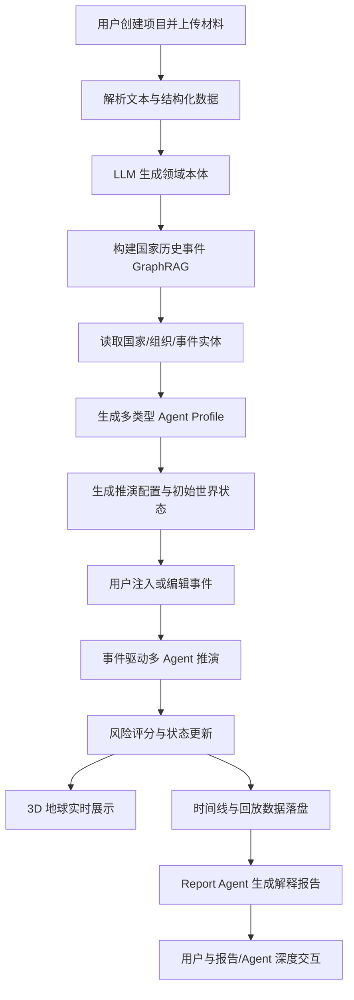

# 基于多智能体的国际局势演化推演与 3D 地球冲突风险可视化沙盘系统技术实现方案

## 1. 文档定位

本文档基于 `概况.md` 的项目设想，并参考 `MiroFish` 代码中的工程实现方式，整理新项目的详细技术版本。重点不放在宣传性描述，而放在可落地的系统架构、模块拆分、数据结构、接口流程、算法逻辑、前后端实现与阶段交付。

新项目可以理解为对 MiroFish 的垂直领域增强版本：MiroFish 的核心能力是“上传种子材料 -> 构建 GraphRAG -> 生成 Agent 人设 -> 运行多 Agent 社会模拟 -> 输出报告与采访交互”；新项目则将模拟对象从通用社交/舆情世界，收敛到“国家、区域组织、媒体、公众、市场、军事力量”等国际关系主体，并增加 3D 地球、地理事件、冲突风险评分、时间线回放和用户事件注入。

## 2. 参考 MiroFish 的可复用工程骨架

MiroFish 当前采用 `Vue 3 + Vite` 前端、`Flask` 后端、`Zep GraphRAG` 知识图谱、`OASIS` 多智能体仿真和本地 JSON 文件状态持久化。该结构对新项目有较强复用价值。

| MiroFish 代码位置 | 当前职责 | 新项目复用方式 |
| --- | --- | --- |
| `MiroFish/backend/app/__init__.py` | Flask 应用工厂、CORS、蓝图注册、请求日志 | 保留应用工厂与蓝图模式，新增 `geo`、`scenario`、`risk`、`event` 等 API 蓝图 |
| `MiroFish/backend/app/config.py` | 环境变量、上传目录、LLM/Zep/OASIS 配置 | 扩展地理数据目录、历史事件库目录、风险模型参数、Cesium token 等配置 |
| `MiroFish/backend/app/models/project.py` | 项目元数据、文件、图谱状态持久化 | 改造成 `ScenarioProject`，增加区域范围、国家列表、时间范围、事件集与风险模型版本 |
| `MiroFish/backend/app/models/task.py` | 异步任务状态、进度、结果 | 直接复用；图谱构建、Agent 准备、推演运行、报告生成、风险回放均可作为任务 |
| `MiroFish/backend/app/api/graph.py` | 上传文件、本体生成、Zep 图谱构建、任务轮询 | 保留 GraphRAG 主流程，改成本项目的历史事件/新闻/国家档案知识构建 |
| `MiroFish/backend/app/api/simulation.py` | 实体读取、人设生成、模拟准备、模拟运行、动作查询、采访 | 拆分为国际局势推演 API，保留 prepare/start/status/actions/interview 模式 |
| `MiroFish/backend/app/api/report.py` | 报告 Agent、分章节生成、工具调用、日志流 | 直接复用 ReportAgent 思路，增加风险解释、关键事件链、缓和路径输出 |
| `MiroFish/backend/app/services/ontology_generator.py` | LLM 自动生成实体/关系本体 | 复用并约束输出为国际关系实体和事件本体 |
| `MiroFish/backend/app/services/graph_builder.py` | 文本分块、Zep 图谱创建、写入、读取 | 复用 GraphBuilderService，知识内容换成国家历史事件、新闻、公开指标 |
| `MiroFish/backend/app/services/zep_entity_reader.py` | 从图谱读取实体并过滤 | 复用实体读取能力，过滤国家、组织、事件、人物、资源、地区等类型 |
| `MiroFish/backend/app/services/oasis_profile_generator.py` | 从实体生成 OASIS Agent Profile | 改造为国家/组织/媒体/公众/市场 Agent Profile 生成器 |
| `MiroFish/backend/app/services/simulation_config_generator.py` | LLM 生成仿真时间、平台、Agent 活跃参数 | 改造为地缘政治推演参数生成器：回合长度、事件强度、响应策略、风险权重 |
| `MiroFish/backend/app/services/simulation_runner.py` | 启动模拟脚本、监控进程、读取动作日志 | 保留进程管理与日志读取，模拟脚本改为国际局势事件引擎 |
| `MiroFish/frontend/src/api/*` | Axios 封装、前后端 API 调用 | 保留 API 分层方式，新增 `geo.js`、`scenario.js`、`risk.js` |
| `MiroFish/frontend/src/views/MainView.vue` | 左图谱 + 右工作台的分屏流程 | 保留分屏工作台，左侧改为 3D 地球/图谱切换，右侧为事件、推演、报告面板 |
| `MiroFish/frontend/src/components/GraphPanel.vue` | D3 图谱展示 | 保留为知识图谱视图；新增 `GlobePanel.vue` 作为主视图 |

## 3. 新项目总体技术架构

### 3.1 分层架构

系统采用五层架构：

1. 数据层：历史事件、新闻文本、国家指标、地理边界、用户自定义事件、推演日志。
2. 知识层：基于 Zep/GraphRAG 的国家历史事件知识库、实体关系图谱、相似案例检索。
3. 推演层：多智能体决策、事件注入、状态机更新、风险评分、时间线生成。
4. 服务层：Flask API、异步任务、项目/场景状态持久化、报告生成、回放数据导出。
5. 可视化层：Vue 3 前端、CesiumJS 3D 地球、风险热力图、事件标注、时间轴、国家面板、报告/采访交互。

### 3.2 推荐技术栈

| 层级 | 技术选择 | 说明 |
| --- | --- | --- |
| 前端框架 | Vue 3 + Vite | 继承 MiroFish 前端结构，降低迁移成本 |
| 地球可视化 | CesiumJS | 内置 3D 地球、相机、GeoJSON、实体标注、时间动态属性，适合地理沙盘 |
| 辅助图表 | ECharts 或 D3 | 风险曲线、事件传播 Sankey、Agent 行为统计 |
| HTTP 客户端 | Axios | 复用 MiroFish 的 `service` 与重试机制 |
| 后端框架 | Flask | 继承 MiroFish 蓝图/API/任务体系 |
| 长任务管理 | Python threading + TaskManager | MVP 复用现有任务轮询；后续可替换 Celery/RQ |
| LLM 接入 | OpenAI SDK 兼容接口 | 复用 `LLMClient`，支持 OpenAI、Qwen 等兼容模型 |
| RAG/图谱 | Zep GraphRAG | 继承 MiroFish 的 GraphBuilderService |
| 仿真引擎 | 自研事件驱动引擎 + 可选 OASIS 适配 | 国际关系状态机自研，舆论传播可继续借鉴 OASIS |
| 状态存储 | MVP: JSON 文件；进阶: SQLite/PostgreSQL | MiroFish 已有 JSON 项目状态；后续引入关系数据库便于查询与回放 |
| 文件解析 | 复用 FileParser | 支持 PDF/MD/TXT，扩展 CSV/JSON 地理和指标数据 |
| 部署 | Docker Compose | 复用根目录 `docker-compose.yml` 思路 |

## 4. 核心业务流程

### 4.1 全链路流程



### 4.2 用户视角流程

1. 创建项目：输入项目名称、地区范围、推演目标，例如“模拟蓝湾海峡冲突升级风险”。
2. 上传材料：上传历史事件资料、新闻简报、国家背景、指标数据。
3. 构建知识库：系统自动抽取实体、关系、事件，构建 GraphRAG。
4. 选择场景：在 3D 地球上选择国家/区域，确认参与主体。
5. 生成 Agent：系统将国家、组织、媒体、公众、市场等实体转为 Agent。
6. 编辑事件：用户可新增“边境冲突、制裁、能源短缺、军事演习、外交谈判”等事件。
7. 开始推演：系统按时间步运行多 Agent 决策与世界状态更新。
8. 可视化查看：地球展示风险热力、事件点、扩散路径、国家状态面板。
9. 回放分析：用户拖动时间轴查看每轮事件、风险变化和 Agent 行动。
10. 生成报告：Report Agent 生成冲突风险解释、关键节点、相似历史案例与缓和建议。

## 5. 后端模块设计

建议在 MiroFish 后端结构基础上扩展为：

```text
backend/app/
  api/
    graph.py              # 复用：知识图谱与本体构建
    scenario.py           # 新增：场景项目、区域、参与主体、时间范围
    event.py              # 新增：用户事件模板、事件注入、事件列表
    simulation.py         # 改造：国际局势推演准备、运行、状态查询
    risk.py               # 新增：风险评分、风险曲线、风险解释
    geo.py                # 新增：国家边界、地理编码、地球图层数据
    report.py             # 复用/增强：报告生成、对话、日志
  models/
    project.py            # 复用并扩展
    scenario.py           # 新增：场景配置数据模型
    event.py              # 新增：事件模型
    world_state.py        # 新增：世界状态快照
    risk.py               # 新增：风险评分结果
    task.py               # 复用
  services/
    ontology_generator.py # 复用
    graph_builder.py      # 复用
    zep_entity_reader.py  # 复用
    geo_service.py        # 新增：GeoJSON、国家坐标、区域映射
    scenario_manager.py   # 新增：场景持久化
    event_engine.py       # 新增：事件模板、影响扩散、时间步推进
    agent_profile_generator.py # 改造：国际关系 Agent 人设生成
    agent_orchestrator.py # 新增：Agent 调度、行动生成、结构化约束
    world_state_manager.py# 新增：世界状态读写、快照、回放
    risk_model.py         # 新增：冲突风险评分
    simulation_runner.py  # 复用进程管理，替换模拟脚本
    report_agent.py       # 复用并增强
    zep_tools.py          # 复用：报告检索工具
  data/
    geo/
      countries.geojson
      country_centroids.json
    templates/
      event_templates.json
      risk_weights.default.json
```

## 6. 数据模型设计

### 6.1 项目模型 ScenarioProject

MiroFish 的 `Project` 只记录文件、本体、图谱和模拟需求。新项目需要额外记录地理范围、参与国家、场景时间线与风险配置。

```json
{
  "project_id": "proj_xxxx",
  "name": "蓝湾海峡冲突推演",
  "status": "graph_completed",
  "simulation_requirement": "推演蓝湾海峡在制裁、军演、舆论压力下的冲突升级风险",
  "region": {
    "name": "Blue Bay Strait",
    "bbox": [110.2, 18.1, 124.8, 28.4],
    "center": [117.5, 23.2],
    "zoom": 4.5
  },
  "participants": ["CountryA", "CountryB", "AllianceC", "UN"],
  "time_range": {
    "start": "2026-05-01T00:00:00",
    "end": "2026-05-15T00:00:00",
    "step_hours": 6
  },
  "ontology": {},
  "graph_id": "mirofish_xxxx",
  "risk_model_version": "risk-v1",
  "created_at": "...",
  "updated_at": "..."
}
```

### 6.2 世界状态 WorldState

世界状态是推演引擎的核心输入与输出。每一个时间步保存一份快照，支持回放和可复现。

```json
{
  "simulation_id": "sim_xxxx",
  "step": 12,
  "timestamp": "2026-05-04T00:00:00",
  "countries": {
    "CountryA": {
      "military_posture": 0.72,
      "diplomatic_tension": 0.81,
      "economic_pressure": 0.44,
      "public_sentiment": -0.36,
      "resource_pressure": 0.28,
      "alliance_support": 0.65,
      "conflict_risk": 0.76
    }
  },
  "relationships": {
    "CountryA->CountryB": {
      "trust": 0.18,
      "hostility": 0.82,
      "trade_dependency": 0.31,
      "military_deterrence": 0.69
    }
  },
  "active_events": ["evt_001", "evt_009"],
  "agent_actions": ["act_101", "act_102"],
  "risk_summary": {
    "regional_risk": 0.74,
    "risk_level": "high",
    "top_drivers": ["军事演习升级", "制裁反制", "媒体舆论升温"]
  }
}
```

### 6.3 事件模型 Event

用户自定义事件和系统生成事件统一使用参数化结构，避免 LLM 自由文本导致不可控。

```json
{
  "event_id": "evt_001",
  "type": "military_exercise",
  "title": "CountryA 在蓝湾海峡附近开展联合军演",
  "description": "舰队靠近争议海域，引发周边国家关注。",
  "timestamp": "2026-05-03T06:00:00",
  "location": {
    "lon": 117.2,
    "lat": 22.8,
    "radius_km": 350
  },
  "actors": ["CountryA", "CountryB"],
  "targets": ["CountryB"],
  "dimensions": {
    "military": 0.75,
    "diplomatic": 0.45,
    "economic": 0.05,
    "media": 0.30,
    "public": 0.20
  },
  "intensity": 0.72,
  "duration_steps": 4,
  "source": "user",
  "evidence": {
    "rag_refs": ["node_uuid_1", "edge_uuid_2"],
    "uploaded_file": "brief.md"
  }
}
```

### 6.4 Agent Profile

Agent 不再只模拟社交平台用户，而是分为多类角色。

```json
{
  "agent_id": 3,
  "agent_type": "country",
  "entity_id": "CountryA",
  "name": "CountryA 国家决策 Agent",
  "goals": ["维护海上通道安全", "降低国内经济压力", "提升区域影响力"],
  "constraints": ["避免全面战争", "维持联盟信任", "控制财政支出"],
  "capabilities": {
    "diplomatic": 0.70,
    "military": 0.82,
    "economic": 0.58,
    "media": 0.45,
    "intelligence": 0.61
  },
  "strategy_bias": {
    "risk_tolerance": 0.64,
    "negotiation_preference": 0.38,
    "retaliation_preference": 0.71,
    "public_opinion_sensitivity": 0.52
  },
  "memory_refs": ["node_uuid_x", "episode_uuid_y"],
  "action_space": ["issue_statement", "negotiate", "sanction", "military_signal", "deescalate"]
}
```

## 7. 知识库与 RAG 实现

### 7.1 知识库内容

GraphRAG 不只存储上传文档文本，还需要围绕国家历史事件组织结构化知识：

| 知识类型 | 示例 | 用途 |
| --- | --- | --- |
| 国家基础档案 | 地理位置、政体、经济结构、联盟关系 | 初始化国家状态 |
| 历史冲突事件 | 战争、边境摩擦、海上冲突、恐怖袭击 | Agent 决策参考与相似案例解释 |
| 外交事件 | 制裁、会谈、联合声明、断交、国际调停 | 外交行动建模 |
| 军事事件 | 军演、部署、误击、巡航、军售 | 军事风险评分 |
| 经济与资源事件 | 能源危机、供应链中断、金融制裁 | 经济压力与资源压力 |
| 舆论事件 | 媒体报道、公众抗议、虚假信息传播 | 舆论扩散和公众情绪 |
| 国际组织响应 | 联合国决议、区域组织调停 | 外部干预建模 |

### 7.2 本体约束

MiroFish 的 `OntologyGenerator` 可自动生成实体与关系，但新项目建议提供一套默认领域本体，再让 LLM 根据上传资料补充。

默认实体类型：

- `Country`
- `Region`
- `InternationalOrganization`
- `MilitaryForce`
- `PoliticalLeader`
- `MediaOutlet`
- `PublicGroup`
- `Market`
- `Resource`
- `HistoricalEvent`
- `ConflictEvent`
- `DiplomaticEvent`
- `EconomicEvent`
- `PublicOpinionEvent`

默认关系类型：

- `ALLY_OF`
- `HOSTILE_TO`
- `TRADES_WITH`
- `SANCTIONED_BY`
- `DISPUTES_REGION`
- `MEMBER_OF`
- `INFLUENCES`
- `ESCALATES`
- `DEESCALATES`
- `SIMILAR_TO`
- `CAUSED_BY`
- `LOCATED_IN`

### 7.3 检索策略

推演时每个 Agent 的行动不应只依赖当前事件文本，而要使用多路检索：

1. 当前事件相似历史案例检索：按事件类型、参与国家、强度、地理区域查询。
2. 国家行为历史检索：查询某国家过去在类似压力下的行动模式。
3. 双边关系检索：查询两个国家之间的冲突、制裁、合作记录。
4. 缓和路径检索：查询历史上相似冲突如何降温。
5. 风险解释检索：为报告生成引用证据。

可在 `ZepToolsService` 基础上扩展工具：

```text
search_similar_events(graph_id, event, limit)
get_country_profile(graph_id, country_name)
get_bilateral_history(graph_id, actor_a, actor_b)
get_deescalation_cases(graph_id, region_or_event_type)
get_risk_evidence(graph_id, risk_driver)
```

## 8. 多智能体推演实现

### 8.1 Agent 类型

新项目建议至少实现六类 Agent：

| Agent 类型 | 职责 | 典型行动 |
| --- | --- | --- |
| 国家 Agent | 决策主体，处理外交、军事、经济、舆论响应 | 声明、谈判、制裁、军演、撤军、求援 |
| 国际组织 Agent | 调停、制裁、维和、发布决议 | 调停提案、观察员派遣、会议召集 |
| 媒体 Agent | 信息扩散、议题放大、立场塑造 | 报道、评论、调查、情绪化标题 |
| 公众情绪 Agent | 模拟国内外公众反应 | 抗议、支持、恐慌、民族主义升温 |
| 市场/资源 Agent | 反映金融、能源、贸易压力 | 油价上涨、供应链中断、资本外流 |
| 裁判/调度 Agent | 执行规则约束、冲突判定、状态合并 | 行动合法性校验、冲突升级判定 |

### 8.2 推演回合

每个时间步按固定顺序执行，确保可复现：

1. 读取上一轮 `WorldState`。
2. 获取当前生效事件和用户新增事件。
3. 对每个 Agent 构造上下文：自身状态、相关事件、RAG 证据、其他 Agent 上轮动作。
4. Agent 输出结构化行动 JSON。
5. 裁判 Agent / 规则引擎校验行动是否合法。
6. EventEngine 将行动转为状态影响。
7. RiskModel 计算国家与区域风险。
8. 写入 `WorldState` 快照、Agent 行动日志、地球可视化帧。
9. 判断是否触发派生事件，例如“误判升级”“制裁反制”“谈判破裂”。

### 8.3 Agent 行动结构

所有 Agent 输出必须是结构化 JSON，避免不可控文本直接进入状态。

```json
{
  "agent_id": 3,
  "step": 12,
  "action_type": "military_signal",
  "target": "CountryB",
  "summary": "宣布在争议海域附近进行防御性巡航",
  "rationale": "回应对方前一轮军演，同时避免直接冲突",
  "intensity": 0.58,
  "dimensions": {
    "military": 0.65,
    "diplomatic": -0.20,
    "economic": 0.00,
    "media": 0.25,
    "public": 0.18
  },
  "expected_effect": {
    "diplomatic_tension": 0.08,
    "military_posture": 0.12,
    "public_sentiment": -0.04
  },
  "evidence_refs": ["node_uuid_1", "node_uuid_2"]
}
```

### 8.4 状态更新规则

状态更新采用“规则模型 + LLM 决策”的混合模式：

- LLM 负责生成行动意图和解释。
- 规则引擎负责数值更新、边界限制和可复现。
- 裁判 Agent 负责处理复杂冲突，例如多方行动相互抵消或放大。

状态更新示例：

```text
new_diplomatic_tension =
  old_diplomatic_tension
  + event.diplomatic * event.intensity * target_sensitivity
  + action.diplomatic_delta
  - mediation_effect

new_conflict_risk =
  weighted_sum(
    military_posture,
    diplomatic_tension,
    economic_pressure,
    resource_pressure,
    public_sentiment_abs,
    escalation_frequency,
    alliance_entanglement
  )
```

## 9. 冲突风险评分模型

### 9.1 风险维度

第一版风险模型建议用可解释加权模型，便于调试和展示：

| 维度 | 字段 | 权重建议 | 解释 |
| --- | --- | --- | --- |
| 军事态势 | `military_posture` | 0.22 | 部署、演习、冲突接触频率 |
| 外交紧张 | `diplomatic_tension` | 0.18 | 谈判破裂、召回大使、声明强度 |
| 经济压力 | `economic_pressure` | 0.12 | 制裁、通胀、贸易中断 |
| 资源压力 | `resource_pressure` | 0.10 | 能源、粮食、水源、关键矿产 |
| 舆论情绪 | `public_sentiment_abs` | 0.12 | 国内公众压力、民族主义、恐慌 |
| 升级频率 | `escalation_frequency` | 0.14 | 最近 N 轮升级事件密度 |
| 联盟牵连 | `alliance_entanglement` | 0.07 | 第三方介入概率 |
| 缓和因子 | `deescalation_momentum` | -0.05 | 调停、停火、撤军、让步 |

### 9.2 风险等级

```text
0.00 - 0.20: low
0.20 - 0.40: guarded
0.40 - 0.60: elevated
0.60 - 0.80: high
0.80 - 1.00: critical
```

### 9.3 可解释输出

每次评分必须输出贡献项：

```json
{
  "country": "CountryA",
  "risk_score": 0.76,
  "risk_level": "high",
  "drivers": [
    {
      "name": "military_posture",
      "contribution": 0.18,
      "reason": "连续两轮军事行动靠近争议区域"
    },
    {
      "name": "diplomatic_tension",
      "contribution": 0.14,
      "reason": "双边谈判失败且双方发布强硬声明"
    }
  ],
  "mitigation_paths": [
    "第三方调停并建立热线",
    "降低军演范围并公开通报",
    "暂停部分制裁以换取谈判窗口"
  ]
}
```

## 10. 3D 地球可视化实现

### 10.1 前端模块

建议新增以下前端结构：

```text
frontend/src/
  api/
    geo.js
    scenario.js
    event.js
    risk.js
  components/
    GlobePanel.vue
    CountryStatusPanel.vue
    EventEditor.vue
    EventTimeline.vue
    RiskLegend.vue
    RiskCurve.vue
    AgentActionFeed.vue
    ReplayControls.vue
  views/
    ScenarioView.vue
    SimulationGlobeView.vue
    ReportView.vue
    InteractionView.vue
```

### 10.2 GlobePanel 职责

`GlobePanel.vue` 是新项目的主可视化组件，职责包括：

- 初始化 Cesium Viewer。
- 加载国家边界 GeoJSON。
- 根据 `country_risk` 给国家多边形上色。
- 渲染事件点、影响半径、扩散弧线。
- 支持点击国家，向父组件抛出 `select-country`。
- 支持时间轴变更后刷新当前帧。
- 支持相机飞行到选定区域。

### 10.3 地图图层

| 图层 | Cesium 实现方式 | 数据来源 |
| --- | --- | --- |
| 国家边界 | `GeoJsonDataSource` | `countries.geojson` |
| 风险热力 | polygon material color | 后端 `/api/risk/frame/:step` |
| 事件点 | `Entity.point` / `billboard` | 后端 `/api/event/list` |
| 影响范围 | `Entity.ellipse` | 事件 `radius_km` |
| 传播路径 | `PolylineGraphics` | 事件扩散边 |
| Agent 行动 | 动态 marker/feed | `/api/simulation/:id/actions` |

### 10.4 风险颜色

```text
low:      #2E7D32
guarded:  #7CB342
elevated: #F9A825
high:     #EF6C00
critical: #C62828
unknown:  #9E9E9E
```

### 10.5 时间线回放

前端维护 `currentStep`，拖动时间轴时调用：

```text
GET /api/simulation/{simulation_id}/timeline?start_step=0&end_step=50
GET /api/risk/{simulation_id}/frame/{step}
GET /api/event/{simulation_id}/active?step=12
```

回放采用两种模式：

- 静态拖动：用户拖动 slider，立即加载对应帧。
- 自动播放：每 500ms 推进一帧，前端使用缓存减少请求。

## 11. API 设计

### 11.1 场景项目

```text
POST   /api/scenario/create
GET    /api/scenario/{project_id}
GET    /api/scenario/list
PATCH  /api/scenario/{project_id}
DELETE /api/scenario/{project_id}
```

`POST /api/scenario/create` 请求：

```json
{
  "name": "蓝湾海峡冲突推演",
  "simulation_requirement": "推演两国在海峡争端中的升级风险",
  "region": {
    "name": "Blue Bay Strait",
    "center": [117.5, 23.2],
    "bbox": [110.2, 18.1, 124.8, 28.4]
  },
  "participants": ["CountryA", "CountryB"],
  "time_range": {
    "start": "2026-05-01T00:00:00",
    "step_hours": 6,
    "steps": 40
  }
}
```

### 11.2 图谱构建

沿用 MiroFish：

```text
POST /api/graph/ontology/generate
POST /api/graph/build
GET  /api/graph/task/{task_id}
GET  /api/graph/data/{graph_id}
```

增强点：

- `ontology/generate` 可接受 `domain_preset=international_relations`。
- `graph/build` 可额外传入 `knowledge_type=historical_events`。

### 11.3 事件系统

```text
POST   /api/event/template/list
POST   /api/event/create
PATCH  /api/event/{event_id}
DELETE /api/event/{event_id}
GET    /api/event/{simulation_id}/list
GET    /api/event/{simulation_id}/active?step=12
POST   /api/event/inject
```

`POST /api/event/inject` 用于运行中动态注入事件：

```json
{
  "simulation_id": "sim_xxxx",
  "step": 12,
  "event": {
    "type": "sanction",
    "actors": ["CountryB"],
    "targets": ["CountryA"],
    "intensity": 0.63,
    "dimensions": {
      "economic": 0.70,
      "diplomatic": 0.40,
      "media": 0.20
    }
  }
}
```

### 11.4 推演

参考 MiroFish 的 `simulation.py`：

```text
POST /api/simulation/create
POST /api/simulation/prepare
POST /api/simulation/prepare/status
POST /api/simulation/start
POST /api/simulation/stop
GET  /api/simulation/{simulation_id}
GET  /api/simulation/{simulation_id}/run-status
GET  /api/simulation/{simulation_id}/actions
GET  /api/simulation/{simulation_id}/timeline
GET  /api/simulation/{simulation_id}/world-state/{step}
```

### 11.5 风险

```text
GET  /api/risk/{simulation_id}/summary
GET  /api/risk/{simulation_id}/country/{country_code}
GET  /api/risk/{simulation_id}/frame/{step}
GET  /api/risk/{simulation_id}/curve?country=CountryA
POST /api/risk/{simulation_id}/explain
```

`GET /api/risk/{simulation_id}/frame/{step}` 返回地球上色所需数据：

```json
{
  "step": 12,
  "timestamp": "2026-05-04T00:00:00",
  "countries": [
    {
      "code": "CTA",
      "name": "CountryA",
      "risk_score": 0.76,
      "risk_level": "high",
      "color": "#EF6C00"
    }
  ],
  "regional_risk": 0.74
}
```

### 11.6 地理数据

```text
GET /api/geo/countries
GET /api/geo/country/{country_code}
GET /api/geo/region/search?q=blue bay
POST /api/geo/geocode
```

### 11.7 报告与交互

沿用 MiroFish：

```text
POST /api/report/generate
POST /api/report/generate/status
GET  /api/report/{report_id}
GET  /api/report/{report_id}/sections
POST /api/report/chat
POST /api/simulation/interview
POST /api/simulation/interview/batch
```

增强点：

- 报告工具可调用风险曲线、世界状态、历史相似案例。
- Interview 不只访问社交 Agent，也可访问国家 Agent、组织 Agent 和裁判 Agent。

## 12. 仿真数据落盘与回放

MVP 可以沿用 MiroFish 的本地目录结构：

```text
backend/uploads/
  projects/
    proj_xxxx/
      project.json
      extracted_text.txt
      files/
  simulations/
    sim_xxxx/
      state.json
      agent_profiles.json
      simulation_config.json
      events.json
      actions.jsonl
      timeline.json
      world_states/
        step_000.json
        step_001.json
      risk_frames/
        step_000.json
        step_001.json
      reports/
```

`actions.jsonl` 每行一条行动，适合增量读取：

```json
{"step": 1, "agent_id": 3, "action_type": "issue_statement", "target": "CountryB", "intensity": 0.4}
```

后续若数据规模增大，迁移到 SQLite/PostgreSQL：

- `projects`
- `simulations`
- `events`
- `world_state_snapshots`
- `agent_actions`
- `risk_scores`
- `reports`

## 13. 前后端页面组织

### 13.1 页面结构

| 页面 | 路由 | 功能 |
| --- | --- | --- |
| 首页 | `/` | 创建项目、查看历史项目 |
| 场景构建 | `/scenario/:projectId` | 上传材料、生成本体、构建图谱、选择区域 |
| 推演准备 | `/simulation/:simulationId` | 生成 Agent、配置时间、编辑初始事件 |
| 地球推演 | `/simulation/:simulationId/run` | 3D 地球、风险热力、事件时间线、动作流 |
| 报告 | `/report/:reportId` | 分章节报告、风险解释、证据引用 |
| 深度交互 | `/interaction/:reportId` | 与 Report Agent / 国家 Agent 对话 |

### 13.2 主界面布局

参考 MiroFish 的 `MainView.vue`，保留顶部状态栏、分屏模式、系统日志。新项目建议：

- 左侧：`GlobePanel` 与 `GraphPanel` 可切换。
- 右侧：按阶段展示工作台。
- 底部或右下角：时间线回放控制。
- 右侧抽屉：国家状态、事件详情、Agent 行动解释。

### 13.3 状态管理

MVP 可以继续使用 Vue `ref/computed` + API 轮询；如果页面交互复杂，再引入 Pinia。

关键前端状态：

```js
const currentProjectId = ref(null)
const currentSimulationId = ref(null)
const currentStep = ref(0)
const selectedCountry = ref(null)
const selectedEvent = ref(null)
const worldFrame = ref(null)
const riskFrame = ref(null)
const activeEvents = ref([])
const agentActions = ref([])
const playback = ref({ playing: false, speed: 1 })
```

## 14. LLM 使用边界

为了保证推演稳定，LLM 只做“生成、解释、检索增强”，不能直接写入最终数值状态。

LLM 可以做：

- 生成领域本体。
- 从实体生成 Agent Profile。
- 根据状态和 RAG 证据生成 Agent 行动 JSON。
- 对关键风险变化做解释。
- 生成报告和问答。

规则代码必须做：

- JSON Schema 校验。
- 行动合法性检查。
- 数值状态更新。
- 风险评分。
- 时间步推进。
- 回放快照保存。
- 安全边界和异常兜底。

## 15. 结构化约束与校验

Agent 输出必须经过三层校验：

1. JSON 解析校验：字段完整、类型正确。
2. Schema 校验：行动类型必须在 Agent 的 action_space 内。
3. 规则校验：例如媒体 Agent 不能直接发起军事行动，国家 Agent 的行动强度不能超过能力和资源约束。

示例规则：

```text
if agent.agent_type == "media":
  allowed_actions = ["publish_report", "amplify_topic", "fact_check", "editorial"]

if action.action_type == "military_signal":
  require agent.agent_type in ["country", "military_force"]
  require agent.capabilities.military > 0.3

if action.intensity > agent.strategy_bias.risk_tolerance + 0.25:
  clamp action.intensity
  record moderation note
```

## 16. 报告生成方案

Report Agent 参考 MiroFish 的 `report_agent.py`，继续采用“先规划大纲，再逐章节 ReAct 生成”的方式。新项目的报告大纲建议固定包含：

1. 执行摘要。
2. 场景背景与参与主体。
3. 初始事件与假设条件。
4. 风险趋势总览。
5. 关键升级/缓和节点。
6. 主要 Agent 行为贡献。
7. 历史相似案例与 RAG 证据。
8. 未来情景分支。
9. 缓和路径建议。
10. 模型局限与可信度说明。

报告工具：

```text
search_graph(query)
get_simulation_context(simulation_id)
get_world_state(step)
get_risk_curve(country)
get_top_risk_drivers(step)
get_agent_actions(agent_id, step_range)
search_similar_events(event_id)
interview_agents(agent_ids, question)
```

## 17. 部署与配置

### 17.1 环境变量

在 MiroFish `.env` 基础上扩展：

```env
LLM_API_KEY=your_api_key
LLM_BASE_URL=https://dashscope.aliyuncs.com/compatible-mode/v1
LLM_MODEL_NAME=qwen-plus
ZEP_API_KEY=your_zep_api_key

FLASK_DEBUG=True
SECRET_KEY=your_secret_key

GEO_DATA_DIR=backend/app/data/geo
EVENT_TEMPLATE_PATH=backend/app/data/templates/event_templates.json
RISK_WEIGHTS_PATH=backend/app/data/templates/risk_weights.default.json
CESIUM_ION_TOKEN=optional_cesium_token
```

### 17.2 本地启动

复用 MiroFish 根目录脚本风格：

```bash
npm run setup:all
npm run dev
```

如新增 Cesium 依赖：

```bash
cd frontend
npm install cesium
```

如新增 ECharts：

```bash
cd frontend
npm install echarts
```

## 18. 阶段实现路线

### 阶段一：MVP 可运行闭环

目标：用最小改造跑通“材料 -> 图谱 -> Agent -> 推演 -> 风险 -> 地球 -> 报告”。

交付内容：

- 复用 MiroFish 项目/任务/图谱 API。
- 新增默认国际关系本体。
- 新增 `ScenarioProject` 字段。
- 新增简单事件模板。
- 新增规则版 `RiskModel`。
- 新增 `GlobePanel.vue`，能显示国家风险颜色和事件点。
- 新增时间线回放 JSON。
- Report Agent 能读取风险曲线并生成报告。

### 阶段二：多 Agent 决策增强

目标：让国家、组织、媒体、市场等 Agent 具备差异化行为。

交付内容：

- Agent Profile Generator 改造。
- Agent 行动 JSON Schema。
- 裁判/调度 Agent。
- RAG 证据注入 Agent prompt。
- 运行中用户事件注入。
- Agent 行动贡献度统计。

### 阶段三：3D 地球体验完善

目标：让沙盘展示具备演示价值。

交付内容：

- 国家边界 GeoJSON 加载。
- 风险热力图。
- 事件影响圈。
- 传播路径弧线。
- 国家详情面板。
- 自动播放/暂停/倍速/跳转回放。
- 图谱视图与地球视图切换。

### 阶段四：可信度与可复现增强

目标：提高报告可信度和实验复现能力。

交付内容：

- 每轮世界状态快照。
- 风险贡献项保存。
- RAG 引用证据链。
- 模型参数版本管理。
- 完整实验导出。
- 多案例对比。

## 19. 第一版建议文件改造清单

如果直接从 MiroFish 开始改造，建议优先改动以下文件：

```text
MiroFish/backend/app/config.py
MiroFish/backend/app/models/project.py
MiroFish/backend/app/api/simulation.py
MiroFish/backend/app/api/report.py
MiroFish/backend/app/services/simulation_config_generator.py
MiroFish/backend/app/services/oasis_profile_generator.py
MiroFish/backend/app/services/simulation_runner.py
MiroFish/backend/app/services/report_agent.py
MiroFish/frontend/src/router/index.js
MiroFish/frontend/src/api/simulation.js
MiroFish/frontend/src/views/MainView.vue
```

建议新增：

```text
MiroFish/backend/app/api/scenario.py
MiroFish/backend/app/api/event.py
MiroFish/backend/app/api/risk.py
MiroFish/backend/app/api/geo.py
MiroFish/backend/app/models/scenario.py
MiroFish/backend/app/models/event.py
MiroFish/backend/app/models/world_state.py
MiroFish/backend/app/models/risk.py
MiroFish/backend/app/services/event_engine.py
MiroFish/backend/app/services/agent_orchestrator.py
MiroFish/backend/app/services/world_state_manager.py
MiroFish/backend/app/services/risk_model.py
MiroFish/backend/app/services/geo_service.py
MiroFish/frontend/src/components/GlobePanel.vue
MiroFish/frontend/src/components/CountryStatusPanel.vue
MiroFish/frontend/src/components/EventEditor.vue
MiroFish/frontend/src/components/EventTimeline.vue
MiroFish/frontend/src/components/RiskCurve.vue
MiroFish/frontend/src/api/geo.js
MiroFish/frontend/src/api/event.js
MiroFish/frontend/src/api/risk.js
```

## 20. 关键技术风险与控制

| 风险 | 表现 | 控制方式 |
| --- | --- | --- |
| LLM 输出不稳定 | Agent 行动格式错误、逻辑漂移 | JSON Schema、重试、规则兜底、行动强度裁剪 |
| RAG 质量不足 | 相似案例牵强、解释不可信 | 固定历史事件库、人工校验样例、引用展示 |
| 3D 地球性能压力 | 国家边界、事件点过多导致卡顿 | 分层加载、LOD、聚合事件、按时间帧缓存 |
| 推演不可复现 | 每次结果差异过大 | 固定随机种子、保存 prompt/参数/快照 |
| 风险评分黑箱 | 用户不知道为什么升高 | 输出风险贡献项、关键事件链、Agent 行为贡献 |
| 用户事件过强 | 注入事件导致状态崩坏 | 模板参数范围限制、裁判 Agent 审核 |
| 国际关系表达敏感 | 输出武断或不当 | 加入不确定性说明、避免真实世界决策建议式断言 |

## 21. 最小可行 Demo 场景建议

建议第一版 Demo 不追求全球所有国家，而选择一个小区域：

- 参与主体：2 个国家 + 1 个国际组织 + 2 个媒体/公众 Agent + 1 个市场 Agent。
- 时间步：24 到 40 步。
- 事件模板：军事演习、制裁、外交谈判、媒体曝光、能源短缺。
- 地图范围：一个区域 bbox。
- 输出：风险曲线、地球热力、事件时间线、关键行动解释、最终报告。

这样能控制计算成本，也便于在展示时讲清楚“事件如何触发 Agent 行动，行动如何改变世界状态，状态如何改变风险，风险如何在地球上呈现”。

## 22. 总结

新项目不需要从零搭建全部工程。最稳妥的路线是保留 MiroFish 已经跑通的“Flask API + Vue 工作台 + 异步任务 + GraphRAG + Agent 生成 + 报告 Agent”工程底座，把核心领域能力替换为国际局势推演：

- 用国家历史事件库替代通用种子文本。
- 用国际关系本体约束图谱构建。
- 用国家/组织/媒体/公众/市场 Agent 替代通用社交 Agent。
- 用事件驱动状态机替代纯社交平台模拟。
- 用可解释风险模型输出冲突风险。
- 用 CesiumJS 3D 地球承载空间展示和时间回放。

第一版应优先实现闭环，而不是追求模型复杂度。只要能做到“上传材料 -> 生成知识图谱 -> 选择区域 -> 注入事件 -> 多 Agent 推演 -> 风险热力展示 -> 报告解释”，项目就具备可演示、可迭代和可扩展的技术基础。
