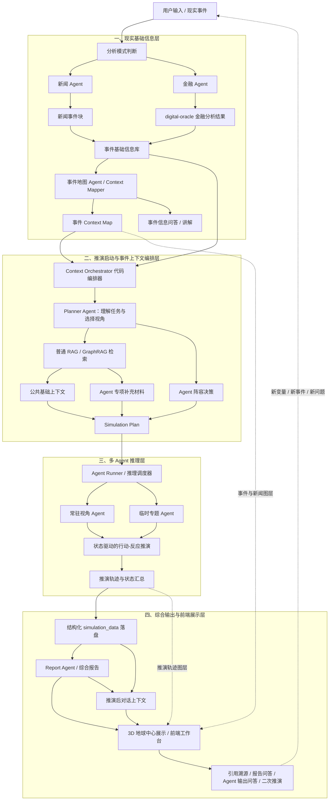

# HelloWorld 架构

## 一、架构目标

本文档用于在《项目大纲》和 `workflow.md` 的基础上，进一步拆解 HelloWorld 的系统架构。当前版本先作为架构讨论骨架，不急于确定所有技术实现细节，重点是明确系统可以拆成哪些核心模块、模块之间如何衔接、每个模块后续需要继续细化哪些问题。

HelloWorld 的整体架构可以先划分为四大模块：

1. 现实基础信息层
2. 事件上下文编排层
3. 多 Agent 推理层
4. 综合输出与前端展示层

其中，现实基础信息层负责生成事件基础信息库和事件 Context Map；事件上下文编排层负责在 Context Map 的帮助下，把事件基础信息库转化为不同 Agent 可高效读取的上下文包；多 Agent 推理层负责基于上下文材料进行多主体、多立场、多轮次推演；综合输出与前端展示层负责生成报告、展示引用依据，并支持用户继续追问或二次推演。

## 二、总体架构图



## 三、模块一：现实基础信息层

现实基础信息层负责回答三个基础问题：第一，现实世界中发生了什么；第二，金融市场如何理解这件事；第三，这些新闻材料和金融材料如何被组织成一张人和后续 Agent 都能读懂的事件说明地图。它是后续所有推理的材料来源。

这一层不按照传统“爬虫模块”的方式设计，而是尽量采用全流程 Agent 化的方式。新闻搜索、新闻 API、RSS、网页读取、正文抽取等能力都只是 Agent 可以调用的工具，模块核心不是爬虫本身，而是能够围绕事件主动检索、筛选、理解和整理信息的 Agent。

模块一的输出不应只有一个底层信息库。它至少应产出两类结果：第一是事件基础信息库，用来保存大量新闻材料、金融材料、原始来源、结构化摘要和引用证据；第二是事件 Context Map，用来向用户和模块二的 Planner Agent 解释“这批材料讲的是什么、材料之间如何关联、哪些信息最关键、哪些问题还不确定”。前者偏向存储和检索，后者偏向理解和导航。

### 1. 新闻 Agent

新闻 Agent 是现实基础信息层的第一类 Agent，负责围绕事件主动检索和整理相关新闻报道。它可以根据用户输入、系统关注事件或已有事件线索，在互联网上搜索相关新闻报道、政府公告、国际组织公开资料、专业报告和其他公开信息。它关注的不是单一新闻源，而是围绕同一事件尽可能收集多来源材料，例如来自 The Guardian、CNN、新华社、路透、AP、半岛电视台、政府网站、国际组织网站和专业智库报告等不同来源的报道与说明。

新闻 Agent 可以调用的工具包括搜索引擎、新闻 API、RSS、网页读取、网页正文抽取、链接跟踪和内容摘要等。工具只负责帮助它获取材料，真正的核心在于 Agent 对材料的判断：哪些报道与事件相关，哪些来源更重要，哪些报道在描述同一事件，哪些信息可以进入事件基础信息库。

新闻 Agent 的输出应是结构化的新闻事件块，而不是一堆原始网页。新闻事件块可以包含事件标题、事件摘要、发生时间、地区、相关主体、主要来源、多来源报道摘要、关键事实、来源链接和待确认信息。

后续需要细化：

- 新闻 Agent 的触发方式：用户输入触发、系统关注事件触发、已有线索触发。
- 新闻 Agent 的工具清单：搜索引擎、新闻 API、RSS、网页读取、正文抽取等。
- 新闻相关性判断规则：如何判断某篇报道是否属于当前事件。
- 多来源聚合规则：如何把多篇报道合并为一个新闻事件块。
- 来源可信度与优先级：如何处理不同来源之间的信息差异。
- 新闻事件块结构：标题、摘要、时间、地区、主体、来源、关键事实、待确认信息。

### 2. 金融 Agent

金融 Agent 是现实基础信息层的第二类 Agent，负责围绕事件主动检索和分析金融市场信息。它的核心能力来自 digital-oracle。当前 digital-oracle 以 skill / 开源项目的形式存在，后续需要进一步考虑如何将它包装成 HelloWorld 内部可调用的金融分析能力。

金融 Agent 可以分析当前预测市场定价，也可以回溯历史事件发生时的资产价格反应，还可以检索已有金融分析报告。它的作用不是直接参与后续多主体立场推演，而是为事件基础信息库补充“市场如何理解这件事”的证据。

金融 Agent 的输出应是结构化的金融分析结果，而不是原始金融数据堆叠。它需要说明参考了哪些预测市场、哪些历史价格窗口、哪些交易信号、哪些金融分析材料，以及这些材料分别说明了什么。

后续需要细化：

- digital-oracle 如何包装为 HelloWorld 可调用能力。
- 金融 Agent 的输入：事件摘要、时间锚点、相关国家、相关市场、用户问题。
- 当前事件、未来事件、历史事件分别如何调用金融分析能力。
- 输出内容：预测市场信号、历史价格反应、交易信号、金融分析报告摘要、关键不确定性。
- 历史事件处理：如何确定事件发生时间窗口，如何回看当时市场反应。
- 当前事件处理：如何读取当前预测市场和交易信号。
- 报告引用：如何保留金融数据和分析材料的来源。

### 3. 事件基础信息库

事件基础信息库由新闻 Agent 生成的新闻事件块和金融 Agent 生成的金融分析结果共同组成。它不是简单文档集合，而是某个事件进入多 Agent 推理前的基础材料包。

这个信息库保存的是最基础的新闻数据和金融数据，包括大量抓取和整理下来的新闻报道、网页正文、来源链接、报道摘要、关键事实、政府或机构公告、金融市场信号、预测市场数据、历史价格反应、金融分析材料和相关引用。它既要保留原始材料，也要保留经过 Agent 整理后的结构化字段，避免后续系统只能看到摘要而无法追溯原文。

事件基础信息库本身更像底层材料仓，不直接等同于给用户阅读的报告，也不直接等同于给模块二使用的上下文。它需要为后续的事件地图 Agent、Context Orchestrator、普通 RAG 和 GraphRAG 提供稳定的数据基础。用户问答和材料讲解不应直接挂在“库”这个概念上，而应由事件地图 Agent 基于这个库来完成。

后续需要细化：

- 事件基础信息库的数据结构。
- 事件卡片字段。
- 新闻 Agent 输出如何进入信息库。
- 金融 Agent 输出如何进入信息库。
- 原始新闻材料、新闻事件块、金融分析结果如何同时保存。
- 不同新闻来源之间如何聚合、去重和保留差异。
- RAG 或检索索引如何建立。
- 事件之间如何建立关联。
- 原始材料和摘要材料如何同时保留。
- 引用来源如何追踪。

### 4. 事件地图 Agent（Context Mapper Agent）

事件地图 Agent 是现实基础信息层的第三类 Agent，负责把事件基础信息库中的大量材料整理成一份可读、可问、可供模块二使用的事件 Context Map。它不负责替代模块三进行多主体推演，而是负责解释现实基础信息：这件事发生了什么，材料来自哪里，哪些主体被卷入，新闻报道之间有什么差异，金融市场留下了哪些信号，哪些问题仍然不确定。

这个 Agent 的存在很重要，因为事件基础信息库里可能有大量来自不同来源的新闻报道和金融材料。如果模块二的 Planner Agent 直接面对完整信息库，很容易被材料规模拖慢，也容易在一开始就抓不到事件结构。事件 Context Map 的作用就是先把底层材料变成一张“信息导航图”，让用户和模块二都能快速理解事件全貌，再决定是否需要进一步下钻到原始材料。

事件 Context Map 可以包含：

- 事件概览：用简明语言说明事件是什么、当前状态如何、为什么重要。
- 时间线地图：梳理事件发生、公开、升级、回应、市场反应等关键时间点。
- 主体地图：列出相关国家、组织、人物、企业、市场和其他关键主体，以及它们之间的关系。
- 来源地图：说明主要材料来自哪些来源，不同来源关注点和叙事角度有什么差异。
- 事实与争议地图：区分多来源共同确认的信息、单一来源信息、互相矛盾的信息和仍待确认的信息。
- 金融信号地图：整理金融 Agent 提供的预测市场、资产价格、历史价格窗口、交易信号和金融分析报告摘要。
- 不确定性地图：列出当前最影响后续推演的问题，例如某一方真实意图、政策反应、市场定价是否充分、事件是否会升级。
- 证据索引：为关键判断保留来源引用，方便用户和模块二继续追溯。

事件地图 Agent 也负责现实基础信息层的问答和讲解。用户可以在进入多 Agent 推演前，直接询问“这件事目前有哪些主要报道”“CNN 和新华社的叙事有什么不同”“金融 Agent 发现了哪些市场反应”“哪些事实还不确定”“这批材料里有没有相似历史案例”等问题。事件地图 Agent 的回答应基于事件基础信息库和 Context Map，并尽量返回引用来源。

因此，事件地图 Agent 的输出有两类：一类是稳定的事件 Context Map，供用户查看，也供模块二的 Planner Agent 作为推演启动时的第一入口；另一类是交互式问答结果，帮助用户理解信息库中的材料。模块二在启动推演时，可以先读取事件 Context Map，再通过普通 RAG 和 GraphRAG 回到事件基础信息库中检索更细的证据。

后续需要细化：

- 事件 Context Map 的标准结构。
- 事件地图 Agent 的输入输出格式。
- Context Map 如何随新新闻和新金融材料更新。
- Context Map 如何区分事实、解释、争议和不确定性。
- 用户问答如何返回引用来源。
- Context Map 与模块二 Planner Agent 的接口如何设计。
- 事件地图 Agent 与新闻 Agent、金融 Agent 的责任边界。

## 四、模块二：推演启动与事件上下文编排层

推演启动与事件上下文编排层位于事件基础信息库、事件 Context Map 和多 Agent 推理层之间，是整个系统里最关键的“信息喂给推理”的中间模块。它在用户输入推演提示词、选择事件或提出分析问题后启动，先读取模块一生成的事件 Context Map，再根据需要回到事件基础信息库中检索原始新闻、金融材料和结构化证据，最终转化成模块三可以直接使用的上下文包和 Agent 启动方案。

这个模块不应被设计成一个完全自由发挥的超级 Agent，也不应在第一版就做成过重的三层材料工厂。更合适的实现方式是“代码编排器 + 轻量规划 Agent”的混合结构：代码层负责流程控制、数据结构、检索调用、上下文长度控制、Agent 数量限制和结果校验；Planner Agent 负责理解用户问题、判断任务类型、识别关键主体、推荐需要启动的 Agent 视角，并说明推荐理由。

因此，模块二的核心产物不是一段长文本，而是一份结构化的 Simulation Plan。模块三拿到这份计划后，就能知道本轮推演要回答什么问题、共享哪些基础材料、启动哪些 Agent、每个 Agent 额外读取哪些专项材料，以及所有材料对应哪些来源。

### 1. 实现形态

模块二可以先实现为一个 Context Orchestrator。它本质上是代码里的编排服务，而不是单纯的 LLM 对话。

Context Orchestrator 的输入包括：

- 用户本轮推演问题或分析目标。
- 模块一生成的事件 Context Map。
- 事件基础信息库中的新闻事件块、金融分析结果、历史材料和来源文档。
- 事件图谱或轻量关系结构中的主体、时间线、市场信号、历史案例和关系边。

Context Orchestrator 的处理流程包括：

- 调用 Planner Agent 理解用户意图，判断本轮任务是当前事件研判、历史复盘、假设推演、风险分析还是多主体反应分析。
- 读取模块一生成的事件 Context Map，形成所有 Agent 共享的公共基础上下文。
- 使用普通 RAG 检索相关文本材料，例如新闻摘要、报告段落、金融分析结果和历史案例。
- 使用 GraphRAG 或轻量图结构查找相关主体、地区、组织、事件链条、市场信号和相似案例之间的关系。
- 根据任务类型、事件主体和用户显式要求，决定本轮需要启动哪些 Agent。
- 为每个 Agent 生成少量专项补充材料，避免所有 Agent 都读取完整信息库。
- 输出结构化 Simulation Plan，交给模块三执行具体推理。

### 2. MVP 上下文设计

模块二第一版不需要完整实现三层材料。更现实的 MVP 是先做两层上下文：

#### 公共基础上下文

公共基础上下文是所有推理 Agent 都会读取的材料，主要来自模块一生成的事件 Context Map。它的作用是让所有 Agent 对同一事件拥有一致的基础事实，而不是让每个 Agent 自己重新理解事件。

公共基础上下文可以包含：

- 事件标题和一句话摘要。
- 事件状态和时间锚点。
- 相关主体、地区和事件类型。
- 关键新闻事实。
- 金融 Agent 的市场信号摘要。
- 主要不确定性。
- 用户本轮问题或推演目标。

#### Agent 专项补充材料

Agent 专项补充材料是根据不同 Agent 的角色，从事件基础信息库中检索出来的少量信息切片。它不是完整材料包，而是“这个 Agent 为了完成自己的视角判断，额外需要知道什么”。

例如：

- 国家 Agent 读取国家立场、战略利益、外交关系、历史行为和相关官方表态。
- 国际组织 Agent 读取规则秩序、协调机制、制裁机制、调停空间和冲突降级路径。
- 市场视角 Agent 读取金融 Agent 输出的市场信号、资产反应、预测市场定价、历史价格冲击和风险溢价。
- 媒体或公众视角 Agent 读取报道差异、叙事框架、社会情绪、民生影响和政策后果。
- 历史类比 Agent 读取相似历史事件、关键差异、当时市场反应和后续演化结果。

原先设想的 Level 0、Level 1、Level 2 三层材料可以作为升级版保留，但不作为第一版实现要求。MVP 阶段可以把“任务材料包”和“Agent 专项上下文”合并处理：先生成公共基础上下文，再为每个 Agent 追加少量专项补充材料。等系统稳定后，再把中间的任务材料包单独拆出来。

### 3. Agent 阵容决策

模块二不仅要准备上下文，还要决定本轮推演需要哪些 Agent。第一版可以采用“规则筛选 + Planner Agent 补充判断”的方式，而不是完全交给 LLM 自由选择。

Agent 阵容可以按以下逻辑决定：

- 从用户问题中判断任务类型：当前研判、历史复盘、假设推演、风险分析、多主体反应分析。
- 从事件基础信息库和图结构中识别关键主体：国家、地区、国际组织、企业、人物、市场、资产类别和历史案例。
- 根据事件类型匹配常驻 Agent：地缘冲突优先启用国家 Agent、军事安全视角和国际组织视角；金融冲击优先启用市场视角、宏观视角和能源视角；选举或政策事件优先启用国内政治视角、媒体视角和预测市场视角；外交事件优先启用相关国家 Agent、国际组织 Agent 和历史类比 Agent。
- 根据用户显式要求强制加入特定 Agent，例如用户要求“从美国视角看”“从金融市场视角看”“参考历史上的类似事件”。
- 控制 Agent 数量，第一版每轮建议保持在 3 到 6 个核心 Agent，避免 Agent 数量过多导致推理发散。

每个被启用的 Agent 都应带有选择理由。例如，系统不仅输出“启用市场视角 Agent”，还应说明“因为金融 Agent 检测到能源价格、避险资产或相关 ETF 在事件窗口内出现明显反应”。这种选择理由后续可以展示给用户，也可以作为调试和复盘依据。

### 4. Simulation Plan 输出

模块二最终应输出结构化的 Simulation Plan，而不是只输出一段自然语言摘要。一个初步的 Simulation Plan 可以包括：

```json
{
  "task_type": "risk_assessment",
  "question": "用户本轮推演问题",
  "shared_context": "所有 Agent 共享的公共基础上下文",
  "selected_agents": [
    {
      "id": "market_signal_agent",
      "type": "market_agent",
      "reason": "事件涉及明显市场定价和风险溢价变化"
    }
  ],
  "agent_contexts": {
    "market_signal_agent": "金融 Agent 输出的市场信号、历史价格窗口和分析报告摘要"
  },
  "evidence_refs": [
    "news_doc_001",
    "market_report_003",
    "event_node_012"
  ],
  "retrieval_trace": "记录本轮检索和图谱查询过程"
}
```

这份计划让模块三可以非常明确地执行推理：哪些 Agent 要启动，每个 Agent 读什么，哪些信息是公共事实，哪些信息是角色专属材料，以及所有判断可以追溯到哪些来源。

### 5. MiroFish 的可借鉴点

MiroFish 在这一阶段的思路值得参考，但不需要照搬。它的处理方式更像是一个推演前的 prepare 阶段：先把输入材料构造成图谱，再从图谱中读取实体，将实体转成 Agent Profile，最后生成模拟配置。

对 HelloWorld 来说，可以借鉴的是这种“推演前准备阶段”的工程化思路：

- 图谱先帮助系统识别重要主体和关系，而不是直接让模型从长文本里临时猜。
- 实体和关系可以辅助决定本轮需要哪些 Agent 视角。
- Agent Profile 和模拟配置应作为结构化产物保存，而不是只存在于一次对话上下文里。
- LLM 可以参与生成配置，但外层需要代码控制流程、格式、数量、上下文长度和兜底规则。
- Agent 分配最好有规则兜底，例如根据实体类型、事件类型、用户问题和显式视角要求来匹配。

但 HelloWorld 与 MiroFish 的目标不同。MiroFish 更偏向社交舆论模拟，容易把图谱中的大量实体转成社交平台 Agent；HelloWorld 更适合从图谱和信息库中选择“本轮推演真正需要的核心视角”。因此，模块二不应把所有实体都变成 Agent，而应围绕用户问题和事件结构，选择少量关键 Agent 进行高质量推理。

### 6. 后续升级方向

当 MVP 稳定后，模块二可以逐步升级为更完整的三层上下文体系：

- Level 0：公共基础上下文，所有 Agent 共享。
- Level 1：任务材料包，围绕本轮用户问题组织的核心证据集合。
- Level 2：Agent 专项上下文，每个 Agent 根据自身角色读取的定制材料。

同时，GraphRAG 也可以从轻量图结构逐步增强。第一版只需要维护事件、主体、组织、市场信号、历史案例、来源文档之间的基本关系；后续再考虑更复杂的实体消歧、关系权重、时间演化和相似案例检索。

后续需要继续细化：

- Context Orchestrator 的具体接口和数据结构。
- Planner Agent 的输入输出格式。
- 普通 RAG 与 GraphRAG 的检索顺序。
- Agent 阵容决策的规则表。
- Simulation Plan 的最终 JSON Schema。
- Agent 在推理过程中如何请求更多材料。
- 如何控制上下文长度和信息密度。
- 如何记录某个 Agent 实际读取了哪些材料。

## 五、模块三：多 Agent 推理层

多 Agent 推理层是 HelloWorld 的核心推演执行部分。它不直接面对原始新闻和金融数据，也不负责从零决定 Agent 阵容，而是读取模块二生成的 Simulation Plan，并根据其中的公共上下文、Agent 专项材料、Agent 阵容和证据索引进行多主体、多立场、多轮次推理。

模块三可以理解为一个 Agent Runner：它负责解析 Simulation Plan、匹配或生成 Agent、分发上下文、维护推演状态、控制行动-反应循环、记录状态变化，并把推演轨迹交给后续的综合输出层。它的重点不是再做一次信息检索，也不是让 Agent 简单发表观点，而是让不同主体在同一组现实基础信息和不断变化的模拟状态中，依次观察、判断、行动、触发其他主体回应。

### 1. 输入：Simulation Plan

模块三的启动输入是模块二生成的 Simulation Plan。第一版可以重点读取以下内容：

- task_type：本轮任务类型，例如当前研判、历史复盘、假设推演、风险分析、多主体反应分析。
- question：用户本轮要回答的问题。
- shared_context：所有 Agent 都需要读取的公共基础上下文。
- selected_agents：模块二建议启动的 Agent 阵容，以及每个 Agent 的启用理由。
- agent_contexts：每个 Agent 的专项补充材料。
- evidence_refs：本轮材料对应的新闻、金融分析、事件节点和来源引用。
- retrieval_trace：模块二检索和选择材料的过程记录。

模块三不应绕过 Simulation Plan 自行读取完整信息库。它可以在推理过程中提出补充材料请求，但补充材料应通过模块二的 Context Orchestrator 回到事件基础信息库中检索，避免 Agent 自己无边界地扩展上下文。

### 2. Agent 分层

模块三中的 Agent 可以分成两类：常驻视角 Agent 和临时专题 Agent。

#### 常驻视角 Agent

常驻视角 Agent 是长期存在、反复使用、需要仔细打磨 Profile 的核心视角。它们不是每次推演临时生成的，而是存放在 Agent Profile Library 中，具有稳定的人设、判断框架、关注变量和输出格式。

例如，中美这类关键国家视角就适合作为常驻 Agent。中国视角 Agent 和美国视角 Agent 不应该只是一句“代表中国/美国立场”的提示词，而应该有较完整的 Profile，包括战略利益、政策工具、历史行为模式、对外叙事、风险偏好、红线、常见误判、对不同地区议题的关注优先级，以及在推演中应该如何区分事实、立场和推测。

常驻视角 Agent 可以包括：

- 中国视角 Agent：关注国家安全、主权议题、周边稳定、经济发展、外交空间、国际秩序叙事。
- 美国视角 Agent：关注盟友体系、全球领导力、国内政治约束、军事部署、制裁工具、市场与舆论压力。
- 市场视角 Agent：关注资产价格、风险溢价、预测市场、流动性、避险交易和金融 Agent 提供的市场信号。
- 国际组织视角 Agent：关注规则秩序、调停机制、制裁合法性、人道主义影响和冲突降级空间。
- 历史类比视角 Agent：关注相似历史事件、关键差异、演化路径和类比失效风险。
- 汇总 Agent：负责归纳不同 Agent 的判断、分歧、共识、关键不确定性和后续观察变量。

常驻 Agent 的 Profile 应该独立维护，而不是每次由 LLM 临时生成。模块二的 Simulation Plan 只负责决定本轮是否启用它，以及给它喂哪些事件专项材料。

#### 临时专题 Agent

临时专题 Agent 是在一次推演过程中根据 Simulation Plan 按需生成的 Agent。它适合处理那些非常具体、非常事件化、没有必要长期维护成常驻 Agent 的视角。

例如，某次事件涉及能源运输，可以临时生成能源航运风险 Agent；涉及某个小国国内政治，可以临时生成该国政治 Agent；涉及某次选举，可以临时生成选举制度 Agent；涉及某条海峡、某个港口、某个商品供应链，也可以临时生成对应的专题 Agent。

临时专题 Agent 的 Profile 应由模块三根据 Simulation Plan、事件 Context Map、agent_contexts 和启用理由生成。它的 Profile 应该明确：

- 这个 Agent 为什么被创建。
- 它本轮只负责分析什么问题。
- 它可以读取哪些材料。
- 它不能越界判断哪些问题。
- 它需要输出哪些结论、风险和不确定性。
- 它是否只在本轮推演中存在，还是值得沉淀为未来的常驻 Agent 候选。

临时 Agent 的原则是“短期、清晰、受限”。它不能变成一个什么都能看的通用 Agent，否则会和常驻视角 Agent、模块二的 Planner Agent 产生职责重叠。

### 3. Agent 激活与生成流程

模块三可以按以下流程执行：

1. 解析 Simulation Plan，读取任务类型、问题、公共上下文、Agent 阵容和专项材料。
2. 将 selected_agents 与 Agent Profile Library 做匹配。如果有对应常驻 Agent，则直接激活常驻 Agent。
3. 如果 selected_agents 中出现没有常驻 Profile 的角色，则根据 Simulation Plan 生成临时专题 Agent。
4. 根据 Simulation Plan 初始化 Simulation State，写入初始事件、初始行动、参与主体、关键变量和停止条件。
5. 按状态变化选择需要观察和回应的 Agent，并为其分发公共上下文、专项材料、当前可见状态和行动输出要求。
6. 接收 Agent 的行动决策包，校验后写入 Simulation State，并评估该行动造成的后果。
7. 根据更新后的 Simulation State 路由下一步回应主体，直到达到停止条件。
8. 收集完整推演轨迹，交给汇总 Agent 或综合输出层整理成状态演化链、关键行动、风险路径、分歧和后续观察变量。

这个流程里，模块三既不是完全静态地调用固定 Agent，也不是每次把所有 Agent 都重新生成。它应该优先使用高质量常驻 Agent，在确实需要时才生成临时专题 Agent。

### 4. 状态驱动的行动-反应推演

模块三的推演方式应更接近状态仿真，而不是简单的观点交叉讨论。系统需要维护一个持续变化的 Simulation State，记录当前事件状态、各主体已采取的行动、各主体可观察到的信息、市场或舆论反应、未解决变量和推演日志。

Simulation State 不应被设计成一组固定指标表。国际事件类型差异很大，战争、贸易战、外交访问、金融危机、政变和供应链冲击不可能共用同一套固定字段。因此更合适的结构是“固定外壳 + 动态场景状态模型 + 事件账本 + 行动日志 + 派生风险视图”。固定外壳负责记录 simulation_id、step、时间、参与主体、停止条件和证据索引；动态场景状态模型由 Simulation Plan 和场景类型决定，用来声明本轮推演需要追踪哪些变量；事件账本保留复杂事件原貌；派生风险视图只负责把当前状态转化为前端和报告可展示的风险、趋势和解释。

例如在贸易战场景中，用户输入或模块二给出的初始状态可能是“美国将关税提高到 50%”。此时系统不应只是让美国视角 Agent 和中国视角 Agent 分别评论，而应把“美国加税到 50%”作为初始事件写入事件账本，并据此生成第一帧 Simulation State。随后中国视角 Agent 观察到这个状态变化，判断自身利益、政策工具和可能代价，然后提交一个行动提案，例如“将关税提高到 100%”。这个行动提案需要先经过校验和裁判层裁决，只有被采纳后才写入事件账本并触发状态更新。随后美国视角 Agent 观察到“中国加税到 100%”这个新状态，再判断美国可能升级、谈判、制裁、豁免、转向盟友协调或释放缓和信号。整个过程是连续的行动、观察、再行动，而不是一次性判断。

第一版可以采用如下推演循环：

1. 初始化状态：Agent Runner 根据 Simulation Plan 创建 Simulation State，包括初始事件、用户问题、参与主体、公共上下文、可用 Agent、初始行动和停止条件。
2. 状态观察：系统判断当前状态变化会被哪些 Agent 观察到，并只向相关 Agent 披露必要信息。
3. 主体判断：被激活的 Agent 根据自身 Profile、公共上下文、专项材料和当前可见状态，判断这个变化对自身目标意味着什么。
4. 行动生成：Agent 输出一个结构化行动，说明要采取什么动作、针对谁、强度多大、何时执行、为什么这样做。
5. 行动校验：Agent Runner 检查行动是否符合格式、是否越界、是否与该 Agent Profile 和已知现实约束明显冲突。
6. 行动裁决：裁判层判断行动是否采纳、拒绝、削弱、延迟或与其他行动合并。Agent 只能提交行动提案，不能直接修改 Simulation State。
7. 状态更新：系统先把被采纳或被拒绝的行动写入事件账本和行动日志，再由状态评估节点根据规则引擎或领域包更新事件状态、市场反应、外交压力、舆论变化、升级风险或其他动态变量。
8. 路由下一步：根据新状态判断下一个或下一组需要回应的 Agent，继续进入下一轮观察和行动。
9. 停止推演：当达到最大步数、进入稳定状态、触发升级阈值、用户要求暂停，或汇总 Agent 判断继续推演收益不高时停止。

在这种设计下，模块三的“轮次”不是 Round 1 独立判断、Round 2 交叉回应，而是一个可追踪的状态演化链条。每一步都应该记录：谁观察到了什么，如何解释，采取了什么行动，行动如何改变状态，又触发了谁的下一步回应。

MVP 阶段可以先做单线行动链，例如“美国行动 -> 中国回应 -> 美国再回应 -> 市场视角评估 -> 汇总”。等第一版稳定后，再扩展为多主体并行反应，例如美国、中国、欧盟、市场和国际组织在同一状态变化后分别产生行动或评估，再由 Agent Runner 决定哪些行动进入下一步状态。

### 5. 单个 Agent 输出格式：行动决策包

在状态推演中，Agent 的输出不应只是观点评论，而应是结构化的行动决策包。不同 Agent 可以输出不同类型的决策：国家类 Agent 输出政策或外交行动，市场视角 Agent 输出市场反应评估，国际组织 Agent 输出调停或规则动作，历史类比 Agent 输出相似案例提醒。

国家类或主体类 Agent 的输出可以包括：

- observed_state：本轮它观察到了什么状态变化。
- interpretation：它如何理解这个状态变化对自身利益、风险和约束的影响。
- current_objective：它当前最想实现的目标，例如威慑、反制、降温、争取谈判筹码、维护国内政治支持。
- proposed_action：它建议采取的行动，包括行动类型、目标对象、强度、时间和公开表述。
- rationale：为什么选择这个行动，引用了哪些 Profile 规则、公共上下文、专项材料或 evidence_refs。
- expected_effects：它预期该行动会产生什么效果。
- expected_countermoves：它预判其他主体可能如何回应。
- risks：该行动可能带来的反噬、升级风险、市场冲击或外交成本。
- confidence：该判断的置信度。
- assumptions：该行动依赖哪些关键假设。
- request_more_context：如果材料不足，需要向模块二请求什么额外信息。

非行动类 Agent 的输出可以更偏评估。例如市场视角 Agent 不一定直接“行动”，而是评估某一行动可能如何影响资产价格、风险溢价、预测市场和投资者预期；历史类比 Agent 不一定执行政策动作，而是提醒当前状态与哪些历史案例相似、哪里不能类比。

所有 Agent 都必须区分“现实基础材料”“当前模拟状态”“基于 Profile 的主体判断”和“模型推测”。尤其是国家类 Agent，输出的是“在该 Profile 和当前模拟状态下可能采取的行动”，不能写成真实政府已经做出的决定；市场类 Agent 也不能把单一价格信号当成确定结论。

### 6. LangGraph 适配

这种状态驱动的行动-反应推演适合用 LangGraph 或类似的有状态图编排框架实现。原因是模块三天然不是一条线性链路，而是一个带状态、分支、循环、条件路由和检查点的推演过程。

模块三可以把 Simulation State 作为图状态，但需要明确：LangGraph 只负责调度状态流转，不能替代业务数据库，也不能让 Agent 直接写世界状态。每个节点应读取当前 State，返回 State patch；图通过条件边决定下一步走向。日志类字段需要采用追加式 reducer，避免后续并行 Agent 输出时互相覆盖；当前 world_state 可以覆盖更新，但 observations、action_proposals、referee_results、state_transitions、risk_frames 和 frame_logs 等历史轨迹必须追加保存。

核心节点可以包括：

- init_state：根据 Simulation Plan 初始化世界状态、参与主体、行动日志和停止条件。
- build_scenario_state_model：根据任务类型、事件类型和 Simulation Plan 生成本场景的动态状态变量、变量类型、可观察范围和停止条件。
- select_next_actors：根据当前状态选择下一个或下一组需要观察和回应的 Agent。MVP 可以先返回单个 Agent，后续再扩展为多主体并行反应。
- build_observations：向被激活的 Agent 渐进式披露本轮可见状态、相关行动、必要材料和 agent_context，而不是把完整 Simulation State 全量暴露给所有 Agent。
- actor_decision：调用常驻视角 Agent 或临时专题 Agent 生成行动决策包。
- validate_action：检查行动是否符合格式、边界和基本现实约束。
- referee_action：裁判层判断行动是否采纳、拒绝、削弱、延迟或与其他行动合并。这里可以混合使用规则校验和 LLM 辅助裁决。
- record_action_ledger：把行动提案、采纳结果、拒绝原因和证据引用写入事件账本与行动日志。
- evaluate_consequence：调用规则引擎或领域包，评估行动对动态场景变量、关系图、市场信号、外交压力、升级风险和其他状态的影响。
- commit_state_transition：提交状态变化，生成新的 world_state，并追加 state_transition 记录。
- score_risk：从当前 world_state 派生风险视图、趋势、关键驱动因素和前端可视化指标。
- persist_frame：把本 step 的 observation、行动提案、裁判结果、状态变化、风险视图和证据引用写入业务数据库，并推送前端。LangGraph checkpoint 只负责执行恢复和调试，不能替代业务持久化。
- route_next_step：判断继续由谁回应、是否请求模块二补充材料、是否进入人类审批，还是进入汇总。
- summarize_trajectory：整理完整推演轨迹、关键分歧、风险路径和观察变量。

LangGraph 的价值不在于替代 Agent 本身，而在于承载这个状态机。它适合实现渐进式披露，因为不同节点可以只把当前 Agent 需要看到的 observation 和 agent_context 传给它，而不是把完整材料一次性塞进去。它也适合实现暂停、恢复、回放和分支推演，但这些能力应建立在清晰的业务状态结构之上。

第一版不必把所有复杂性都做满。可以先做一个固定循环：

```text
init_state
  -> build_scenario_state_model
  -> select_next_actors
  -> build_observations
  -> actor_decision
  -> validate_action
  -> referee_action
  -> record_action_ledger
  -> evaluate_consequence
  -> commit_state_transition
  -> score_risk
  -> persist_frame
  -> route_next_step
      -> select_next_actors
      -> request_more_context
      -> human_review
      -> summarize_trajectory
```

其中 `route_next_step` 应通过条件边回到 `select_next_actors` 继续循环，或进入 `request_more_context` 向模块二请求补充材料，或进入 `summarize_trajectory` 结束推演。如果后续某个节点既要更新状态又要决定跳转目标，可以使用 LangGraph 的动态路由能力，但不能同时再为同一节点配置会造成重复执行的静态后继边。

后续再加入并行主体反应、人类中断审批、状态回放、多分支情景树和分支对比。并行主体反应上线前，需要先定义好并行输出合并方式：多个 Agent 的 action_proposals 进入同一个追加式日志，再由 referee_action 批量裁决，最后由 evaluate_consequence 合并成一次或多次状态变化。

### 7. 后续需要细化

后续需要继续细化：

- Agent Profile Library 的存储结构。
- 中国视角 Agent、美国视角 Agent 等核心常驻 Agent 的 Profile 模板。
- 常驻 Agent 和临时专题 Agent 的匹配规则。
- 临时专题 Agent 的生成模板和边界约束。
- Simulation State 的固定外壳、动态场景状态模型、事件账本、行动日志和派生风险视图如何设计。
- Agent Runner 的状态机接口和执行流程。
- 行动决策包的 JSON Schema。
- 裁判层、事件账本、状态更新和后果评估节点如何设计。
- 如何判断下一步该由哪个 Agent 观察和回应。
- 多主体并行反应如何合并为下一步状态。
- 推演停止条件如何设计。
- Agent 之间是否能看到完整行动日志，还是只能看到与自己相关的观察摘要。
- Agent 请求补充材料时，如何调用模块二的 Context Orchestrator。
- 如何记录每个 Agent 实际读取的材料和引用依据。
- 如何评估某个临时 Agent 是否值得沉淀为常驻 Agent。

## 六、模块四：综合输出与前端展示层

综合输出与前端展示层负责把多 Agent 推理结果整理成用户可阅读、可追溯、可继续操作的成果。

这一层不要求保留仍在运行的 LangGraph 环境。模块三完成推演后，应把本轮推演产物落盘为结构化的 simulation_data、Agent 输出、状态轨迹、证据索引和报告生成输入；模块四只读取这些持久化数据来生成报告、展示过程和支持后续问答。LangGraph runtime 可以在推演结束后释放，LangGraph checkpoint 主要用于执行恢复、调试回放和未来分支推演，不应作为报告和聊天功能的唯一数据来源。

### 1. 综合报告

综合报告不只是新闻摘要，而应整合事件背景、新闻事实、金融市场分析、状态推演轨迹、多 Agent 行动判断、分歧、风险因素、关键不确定性和可能演化方向。

报告生成方式可以借鉴 MiroFish 的工程流程，但不照搬其“未来预测报告”的话术。更合适的方式是采用“异步报告任务 + 大纲规划 + 分章节证据包 + 分章节生成 + 最终组装”的流水线。系统先为一次推演创建 report_id 和生成任务，再根据 Context Map、Simulation Plan、Agent 输出、状态轨迹、风险视图和 evidence_refs 生成报告大纲；随后按章节构造 Evidence Pack，让每个章节只基于给定证据写作，避免报告 Agent 自由扩展材料或混淆现实事实与推演结论。

报告应支持分章节落盘和实时展示。每个章节生成完成后立即保存，前端可以在报告未完成时查看已生成章节、进度和生成日志；最终再组装成完整 Markdown 报告和结构化 JSON。报告完成后，还可以提供报告问答能力：优先基于已生成报告、结构化 simulation_data、Agent 输出和证据索引回答。MVP 阶段不要求报告 Agent 再去采访单个 Agent，也不要求为了报告问答保留 LangGraph runtime。

第一版可以先采用固定报告结构：执行摘要、现实基础与推演设定、多主体判断与行动链、风险路径与触发条件、证据与不确定性。等模块三的状态推演稳定后，再把 WorldState frames、Action logs、Referee results 和 Risk frames 纳入报告证据包。

第一版的 Report Agent 只负责整理模块三已经产生的推演材料。它的输入应是 Context Map、Simulation Plan、simulation_data、Agent 输出、状态轨迹、风险视图和 evidence_refs；它的输出应是综合报告和结构化章节数据，而不是重新调度多 Agent 推理或继续修改 Simulation State。

后续需要细化：

- 报告模板。
- Report 生成任务、进度、分章节内容和生成日志的接口设计。
- Evidence Pack 的结构，以及章节如何绑定 evidence_refs。
- 报告中如何展示不同 Agent 的行动判断。
- 如何展示状态演化链条。
- 如何展示分歧和共识。
- 如何展示金融分析材料。
- 如何展示引用来源。
- 如何标注不确定性。
- 如何支持用户围绕报告继续追问。

### 2. 推演后对话

推演后对话是模块四的展示和解释能力，不是模块三推演环境的延续。系统不需要像 MiroFish 那样在推演结束后保留一个仍然运行的社交环境，也不需要让 Report Agent 自动去采访每个 Agent。后续对话只基于本轮已经落盘的报告、simulation_data、Agent 输出和证据引用来重建上下文。

推演后对话可以分为两类：

- Report Agent 对话：用户围绕最终报告提问时，系统读取综合报告、结构化 report sections、simulation_data、关键 Agent 输出、风险视图和 evidence_refs，并结合当前聊天历史生成回答。它回答的是“这份报告为什么这么写、某个结论依据是什么、哪些不确定性最关键、不同 Agent 判断有什么差异”等问题。
- 单个 Agent 输出对话：用户点开某个 Agent 或某个节点输出后，可以继续追问“你为什么这样判断”“这个行动的依据是什么”“你当时看到了哪些材料”。系统读取该 Agent 的 role spec、input_summary、agent_context、agent_output、evidence_refs 和该会话历史，生成一个基于本次推演材料的视角回答。这里的 Agent 不是仍在运行的 live agent，而是对本次 Agent 输出的解释器。

因此，MVP 只需要保存可重建上下文的数据，不需要保存活着的 Agent 实例。至少应保存：

- SimulationRun：本轮推演的 simulation_id、图版本、开始时间、结束时间和状态。
- SimulationData：模块三最终汇总出的状态轨迹、关键转折、风险路径、分歧、共识和不确定性。
- AgentOutput：每个 Agent 或节点的输入摘要、输出正文、结构化字段、置信度、引用证据和依赖关系。
- EvidenceIndex：报告、Agent 输出和原始材料之间的引用关系。
- Report：最终 Markdown、结构化章节、章节证据包和生成日志。
- ChatSession / ChatMessage：用户后续与 Report Agent 或单个 Agent 输出的对话历史。

只有在后续要支持“继续推演下一步”“从某一步分叉推演”“用户审批后恢复图执行”或“Agent 在对话中继续调用工具并改变状态”时，才需要保留或恢复 LangGraph thread / checkpoint。普通报告问答和单个 Agent 输出问答不应依赖 live runtime。

后续需要细化：

- Report Agent 对话的上下文构造规则。
- 单个 Agent 输出对话的 prompt 模板和边界提示。
- 对话回答如何引用 report sections、agent_outputs 和 evidence_refs。
- 对话历史如何存储、裁剪和再次注入上下文。
- 如何在界面上标注“这是基于本次推演材料的视角回答，不代表真实主体立场”。
- 未来如果接入 LangGraph checkpoint，如何区分 post-hoc 问答、继续推演和分支推演。

### 3. 前端展示

前端需要让用户既能查看最终报告，也能追溯报告背后的事件材料和 Agent 判断过程。

前端的中心形态可以设计为一个 3D 地球工作台。3D 地球不是单纯的视觉装饰，而是整个系统的空间索引和交互中心：模块一产生的新闻事件、来源、国家、地区和金融市场信号，模块三产生的推演主体、行动链、风险路径和状态变化，都围绕这颗地球展开。用户进入系统后，首先看到的是一个可旋转、可缩放、可筛选时间线的地球，而不是传统列表页。

这个 3D 地球可以承载三类主要图层：

- 现实事件图层：来自模块一，展示新闻 Agent 提取出的事件点、涉及国家或地区、来源分布、时间线、金融信号和 Context Map。用户点击某个地区、国家、事件点或跨国连线，可以展开对应新闻材料、来源摘要、关键事实、争议点和证据引用。
- 推演过程图层：来自模块三，展示本次 simulation 中被激活的主体、Agent 行动判断、状态变化、风险升级或降级路径。它可以用时间轴、路径线、冲突/合作连线、风险热区和 step 切换来表现“局势如何从初始事件一步步演化”。
- 报告与解释图层：来自模块四，展示综合报告、章节摘要、证据引用、Report Agent 问答入口和单个 Agent 输出问答入口。用户可以从报告中的某个结论反向定位到地球上的事件、主体、行动链和原始证据。

界面布局上，可以采用“中心地球 + 周边面板”的方式。地球处于视觉中心；左侧或下方面板承载模块一的新闻提取、事件 Context Map 和来源材料；右侧或时间轴面板承载模块三的推演 step、Agent 输出和状态变化；报告面板可以作为可展开的结果层，覆盖在地球旁边，而不是把用户带离当前事件空间。这样用户始终围绕同一个事件空间理解“现实发生了什么”“系统如何推演”“报告为什么这样判断”。

第一版不需要做复杂的 3D 战场或完整地理仿真。MVP 可以先把 3D 地球作为事件坐标和关系展示容器：事件点、国家高亮、主体连线、时间轴、新闻来源列表、推演 step 列表和报告入口即可。后续再加入风险热力图、跨国影响路径、市场冲击图层、多分支推演对比和历史相似事件叠加。

后续需要细化：

- 事件列表或事件面板。
- 单个事件详情页。
- 3D 地球的基础交互：旋转、缩放、国家选择、事件点点击、时间轴筛选。
- 现实事件图层：新闻事件点、来源分布、Context Map、金融信号和证据引用。
- 推演过程图层：Agent 行动链、状态变化、风险路径、主体关系和 step 回放。
- 报告与解释图层：报告章节、结论定位、证据反查和问答入口。
- 金融分析结果展示。
- Agent 行动判断展示。
- Simulation State 演化展示。
- 多轮推演过程展示。
- Report Agent 报告问答入口。
- 单个 Agent 输出问答入口。
- 引用溯源展示。
- 用户继续追问或输入新变量的交互。

## 七、当前优先讨论的问题

后续可以优先围绕以下问题逐步细化：

1. 新闻报道采集与事件整理模块如何设计。
2. 金融分析 Agent 的输入输出格式如何设计。
3. 事件基础信息库的数据结构如何设计。
4. 事件地图 Agent 如何生成 Context Map 并承担基础信息问答。
5. 事件上下文编排层如何把 Context Map 和基础信息库高效喂给多 Agent。
6. 常驻视角 Agent、临时专题 Agent、Agent Runner 和 Simulation State 如何设计。
7. 综合报告、3D 地球展示、推演后对话和引用溯源如何设计。
